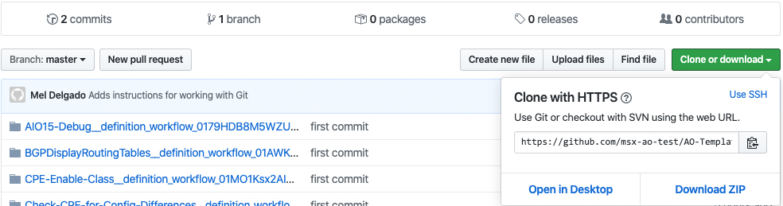

# ao-workflow

Action Orchestrator is a powerful workflow automation and technology-agnostic cross-domain orchestration product. This orchestration platform easily binds Cisco products together and connects smoothly to third-party products and open-source solutions, providing a unified solution.

This repository contains workflows you can resuse in your environment.

## Copying from this repo

If you are new to Git, that's okay. Here are a few steps steps to take to get started:

* Install Git on our computer
* Clone the repository to your local machine

The steps for installing Git varies by the operating system you are running and there are plenty of resources available on the web (including GitHub). Cloning the repository is fairly straight forward:

```git clone https://github.com/msx-ao-test/AO-Templates.git```

The URL can be found via the GitHub user interface on the `Clone or download` button as seen below



## Contribute your ideas

Contributions are welcome! To contribute, we follow the typical GitHub flow where

* Fork if you would like to make a copy of the repo and work on your own changes/additions/modifications (submit a PR if you would like to add your contributions to this repo)
* Clone if you would just like to use what is here
* Branch this repo and submit a PR if you would like to include your contributions back to this repo. Please name the branch after your username and a dash followed by a very brief description of the template you are either modifying or adding.

We'll add instructions on how to perform these steps for those of you who are new to Git and would like to contribute to the repo.

Enjoy!
